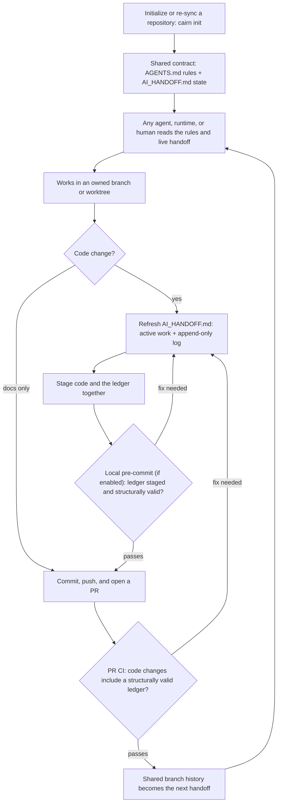

# cAIrn

> cAIrn is a stack of stones left by earlier travelers to mark the trail for
> whoever comes next. You add one stone. You don't rearrange the others.

A cross-agent coordination protocol for repositories worked by more than one AI
coding agent — and a one-command installer that adds it to any repo.

When more than one coding agent has write access to the same project — hosted
or local, commercial or open-weight, autonomous or human-driven — the failure
mode isn't bad code. It's **stranded work**: one agent finishes something on a
branch nobody else knows about, another re-implements it, a third rewrites the
first one's fix. Chat context doesn't survive the session, and no agent can read
another's.

cAIrn fixes that with a single rule, enforced mechanically:

> **Every commit that touches code must also update the shared ledger.**

State lives in the repo, on the branch, in the diff — so it merges, survives
handoffs, and is readable by whichever agent shows up next.

## The workflow at a glance

Every participant follows the same loop; cAIrn does not need to identify their
model, runtime, or role.



`cairn init` attempts to enable the local hook for its clone without replacing
an existing hook setup. CI provides the shared boundary when the local hook is
absent or bypassed.

## Install 

```sh
git clone https://github.com/mcclements02/cairn.git ~/.cairn
ln -s ~/.cairn/cairn /usr/local/bin/cairn   # optional: put it on PATH
```

Then, in any repo:

```sh
cairn init
```

Without the symlink, call it by path — `~/.cairn/cairn init`. On Windows use Git
Bash or WSL; see [Platforms](#platforms).

```
cairn init   [--force] [--scripts-dir DIR] [--entry-file PATH] [--adopt-entry-file PATH] [PATH]
                                                    install or re-sync a repo
cairn check  [--scripts-dir DIR] [PATH]             report drift; exit 1 if any
cairn status [--scripts-dir DIR] [PATH]             cross-worktree stranded work
cairn hooks  [--scripts-dir DIR] [PATH]             enable hooks in this clone
cairn resources [PATH]                              host-local RAM/process snapshot (read-only)
cairn help
```

Re-running is safe and is how you re-sync cAIrn-owned files. It never overwrites
the append-only ledger or an existing native instruction file without an explicit
`--force` request for that convenience pointer/hook.

## The two-file split

The protocol's whole design rests on one separation:

| File | Holds | Lifecycle |
|------|-------|-----------|
| `AGENTS.md` | **Rules** — branch ownership, safe editing, validation ladder, handoff requirements | Edited deliberately; mostly stable |
| `AI_HANDOFF.md` | **State** — what is in flight, on which branch, by which actor/runtime/model, validated how | Updated with *every* code change |

Mixing the two is why "just put it in the prompt file" fails: rules get buried
under status, status goes stale, and agents stop trusting either.

Everything else routes to those two. `AI_WORKSPACE.md` and the bundled root-file
shims are **pointers only** — two to five lines that say "read `AGENTS.md`".

cAIrn ships three of those shims because several tools look for a specific
filename at the repository root and will not find `AGENTS.md` on their own. They
are a convenience, not a supported-agent list, and cAIrn neither detects nor
requires the tools they are named for. A missing shim is created; an existing
native instruction file is preserved. To decline a missing convenience shim,
list it in `.cairnignore`:

```
# .cairnignore — decline the bundled shims
CLAUDE.md
GEMINI.md
CHATGPT.md
```

Then register whatever your tools actually read with `--entry-file` or
`--adopt-entry-file`, below. Per-tool instruction files are where drift breeds,
so keeping every one of them empty of rules means there is exactly one authority
per repo.

`AGENTS.md` is the portable contract. A model family does not determine an
instruction-file convention, so configure any runtime that does not already
read `AGENTS.md` to load it from the repository root. For a plain-text
runtime-specific entry point, register any repository-relative path without
teaching cAIrn about the runtime or model:

```sh
# Creates and keeps a generic cAIrn routing block in this entry file.
cairn init --entry-file .agents/instructions.md

# Preserves an existing instruction file and appends only cAIrn's marked block.
cairn init --adopt-entry-file docs/agent-onboarding.md
```

The same explicit adoption path works for an existing root convention such as
`CLAUDE.md`: `cairn init --adopt-entry-file CLAUDE.md` preserves its content and
appends only cAIrn's marked routing block. Use `--force` only when you intend to
replace one of cAIrn's convenience pointers or the local pre-commit hook; it
never replaces `AI_HANDOFF.md` history.

Registered paths live in `.cairn/entry-files`, so future `cairn init` and
`cairn check` runs keep the same entry points in sync. cAIrn never discovers or
overwrites arbitrary instruction files: a runtime's filename and syntax remain
the operator's choice.

Registering or adopting an entry point is a project change. Before committing
that configuration, add the corresponding `AI_HANDOFF.md` Log entry; cAIrn does
not fabricate an actor, summary, or validation result on an agent's behalf.

## The ledger

`AI_HANDOFF.md` has two sections, shaped by how git merges them:

**Active Work** — one row per in-flight branch/worktree. Different branches own
different rows, so concurrent edits merge cleanly instead of conflicting.

**Log** — append-only, newest on top. Each entry records date · branch · actor ·
files · validation · status · next. The actor is free text and cAIrn never
validates it: a model name, a runtime, a CI job, a seat like `reviewer`, or a
human teammate are all equally valid. Use whatever your team can attribute work
to six months from now.

> A merge conflict in the Log means two agents diverged. Resolve it by keeping
> **both** entries — never by dropping one. The conflict *is* the signal.

## Enforcement

A convention no one enforces is a convention no one follows. Three layers:

**Local** — `.githooks/pre-commit` rejects a commit that stages code without
staging `AI_HANDOFF.md`, rejects code deletions without a ledger update, and
refuses to delete, replace, or empty the ledger's required sections. Markdown
and text are exempt, so docs work is unblocked. Bypass with `git commit
--no-verify`.

**CI** — `.github/workflows/cairn.yml` runs the same classification on every
PR and verifies the ledger remains a regular tracked file with its `Active Work`
and `Log` sections. Docs-only PRs pass naturally; no label can bypass a
code-only change.

**Visibility** — `cairn-status.sh` reports every worktree, its dirty count,
every local branch not merged into the base, and the three newest ledger
entries. It performs no git mutations. Run it before starting work to see whose
toes you're about to step on.

**Host diagnostics** — `cairn resources` is an opt-in, read-only local snapshot
of physical RAM, memory availability/swap, and the top visible processes by RSS.
It is model- and vendor-neutral and never writes a handoff entry. macOS and Linux
are supported; under WSL it reports the Linux VM rather than all Windows-host
memory.

## What gets installed

```
AGENTS.md                        rules      seeded once; only the marked ledger block is re-synced
AI_HANDOFF.md                    state      seeded once; never overwritten
AI_WORKSPACE.md                  pointer
<root-file shims>                three pointer files named for the common root-file
                                 conventions; created only when absent, existing files preserved
.cairn/entry-files               optional registry for arbitrary runtime entry files
<registered entry files>         optional cAIrn routing blocks; only marked blocks are managed
.githooks/pre-commit             local enforcement
scripts/cairn-hooks.sh       enable hooks (once per clone)
scripts/cairn-status.sh        cross-worktree stranded-work view
scripts/cairn-check.sh      CI mirror of the hook's classification
scripts/cairn-resources.sh  host-local RAM/process snapshot
.github/workflows/cairn.yml    PR enforcement
.gitattributes                  cAIrn-managed LF-protection block, merged with local rules
.cairnignore                  optional; paths this repo customizes on purpose
```

**Managed files** are rewritten from `templates/` on every run — that's what
makes re-running a repair. Existing native instruction files and pre-commit
hooks are preserved unless explicitly forced. **Content files** (`AGENTS.md`,
`AI_HANDOFF.md`) are seeded once and never clobbered. In an existing `AGENTS.md`,
only one complete region between `<!-- cAIrn-LEDGER:BEGIN -->` and
`<!-- cAIrn-LEDGER:END -->` is replaced; malformed or duplicate markers are
refused rather than risking surrounding user content.

## Protecting a deliberate local change

Some repos customize a managed file on purpose. A project that commits runtime
artifacts — model outputs, captured fixtures, evidence checkpoints — may need
the hook to stop counting those as code, because such a commit carries no ledger
entry by design. Without the exemption the operator learns to reach for
`--no-verify`, which is how a guard stops guarding.

Overwriting a considered change like that is worse than leaving it drifted. List
the path in `.cairnignore` at the repo root:

```
# deliberately customized — runtime-state exemption, mirrored in ci-check
.githooks/pre-commit
scripts/cairn-check.sh
```

Ignored paths are neither rewritten nor reported as drift.

## Platforms

macOS, Linux, and Windows under **Git Bash** (ships with Git for Windows) or
**WSL**. It needs bash plus the coreutils that come with git — no runtime, no
package manager, nothing to install.

It does not run in `cmd.exe` or PowerShell directly. The git hook it installs is
invoked by git itself, which uses its bundled `sh` on Windows, so hooks work
regardless of which shell you drive git from.

The installer merges a cAIrn-owned LF-protection block into `.gitattributes`, and
strips `\r` from templates on the way out. Without both, a default Windows checkout
(`core.autocrlf=true`) rewrites the scripts to CRLF and bash dies on the stray
carriage return with `set: pipefail: invalid option name`.

## Migrating from a pre-rename install

`cairn init` detects the old `ai-sync-*` layout and moves it — with `git mv`
where the files are tracked, so history follows:

```
scripts/ai-sync-install.sh   -> scripts/cairn-hooks.sh
scripts/ai-sync-status.sh    -> scripts/cairn-status.sh
scripts/ai-sync-ci-check.sh  -> scripts/cairn-check.sh
.github/workflows/ai-sync.yml -> .github/workflows/cairn.yml
.ai-sync-ignore              -> .cairnignore
```

`AGENTS.md`'s `AI-SYNC-LEDGER` markers are rewritten to `CAIRN-LEDGER` in place,
so the block is upgraded rather than duplicated.

In `AI_HANDOFF.md`, **only the header is retargeted.** Everything from `## Log`
down is append-only history and is left byte-for-byte alone — a stale script
path inside a 2026-07 entry is *correct*, because that is what the command was
called when the entry was written. A tool that enforces append-only has no
business rewriting the past.

If you have a required status check named "AI-SYNC ledger check" in branch
protection, rename it to "cAIrn ledger check" after the first PR lands.

## Notes from the field

**Script directory casing.** Xcode projects conventionally use `Scripts/`;
everything else uses `scripts/`. The installer detects which by asking git what
casing it *tracks*, then falling back to `find`, which string-compares the real
directory entry. It never tests with `[ -d Scripts ]` — on macOS's
case-insensitive APFS that is true even when the real directory is `scripts/`,
which makes detection flip-flop and rewrite files on every run.

**`cairn-hooks.sh` is per-clone, not per-repo.** It sets
`core.hooksPath=.githooks`, which is local git config — it does not travel with
a clone. Every fresh clone needs it run once. It is shared across all linked
worktrees, and it refuses to stomp an existing `core.hooksPath` (husky, etc.)
unless you pass `CAIRN_FORCE=1` (the older `AISYNC_FORCE=1` remains accepted for
compatibility). If `.githooks/pre-commit` already belongs to the repository,
cAIrn preserves it and asks you to deliberately chain or force replacement.

**The hook is a reminder, not a gate.** `--no-verify` exists and agents will
find it. The CI check is the real boundary; the hook just moves the correction
from review time to commit time.

## License

MIT
